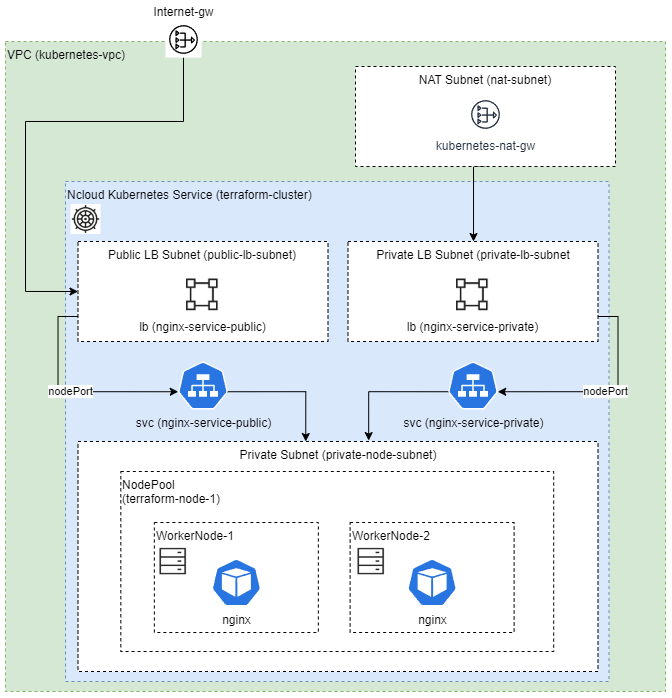
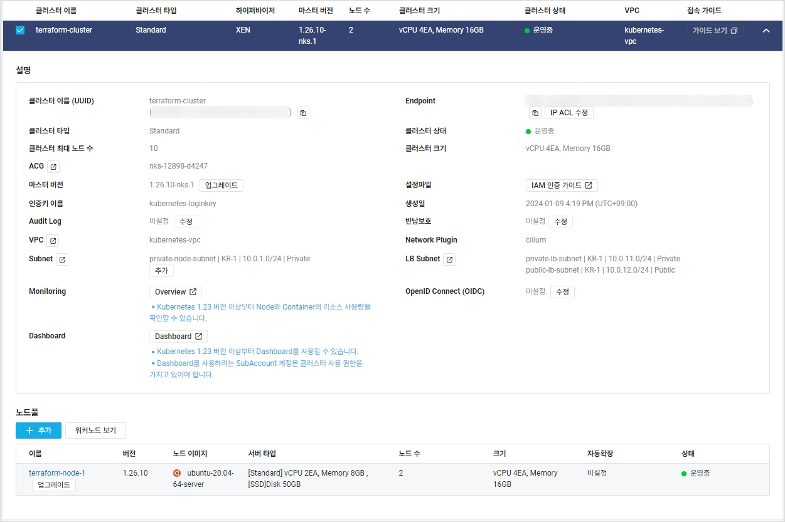

# 테라폼을 통해 Ncloud Kubernetes Service 클러스터 구축하기

클라우드 환경을 구축하고 관리하는 일은 복잡한 업무입니다. 네이버 클라우드 플랫폼은 클라우드 리소스를 효율적으로 관리할 수 있도록 콘솔, API, CLI, 테라폼과 같은 다양한 도구를 제공하고 있습니다. 특히 테라폼 프로바이더의 코드를 오픈소스로 관리하여 지속적인 확장 및 개선을 진행하고 있습니다. 오픈소스 생태계를 통해 사용자들은 직접 기능 개선 및 버그 수정과 같은 방식으로 기여할 수 있게 되며, 사용자 친화적인 기능을 경험할 수 있습니다.

Ncloud Kubernetes Service(이하 NKS)는 2020년에 출시되어 지속적으로 발전을 거듭하고 있습니다. 최근 네이버 클라우드 플랫폼에 Public LB Subnet이 도입되면서 테라폼을 통해 Ncloud Kubernetes Service를 생성하는 방식이 변경되었습니다. 본 포스팅에서는 변경 내용을 확인하고 테라폼을 활용하여 클러스터를 생성하고 사용하는 과정에 대해 소개하겠습니다. 이 과정을 통해 사용자들은 새로운 기능과 변경점을 이해하고, 서비스를 효과적으로 생성하고 관리할 수 있게 됩니다.



## ncloud provider를 통한 kubernetes cluster 생성

ncloud provider를 이용하기 위해서는 네이버 클라우드 플랫폼 계정, API 키, 테라폼이 설치되어 있어야 합니다. 본 글에서는 필요한 사항들이 이미 준비되어 있으며 테라폼에 대한 기본적인 지식을 갖추고 있다는 전제 하에 작성되었습니다. 이 장에서는 ncloud provider를 통해 Kubernetes Cluster를 생성하는 방법을 소개합니다.

### API 환경 변수 설정

ncloud API를 사용하는데 필요한 인증 정보와 엔드포인트 정보를 환경 변수로 설정합니다. `NCLOUD_API_GW`는 테라폼에서 직접적으로 사용되지 않지만 NKS 클러스터의 kubeconfig 파일을 생성하는데 사용됩니다.

```
export NCLOUD_ACCESS_KEY=ACCESSKEY
export NCLOUD_SECRET_KEY=SECRETKEY
export NCLOUD_API_GW=https://ncloud.apigw.ntruss.com
```

### ncloud provider 설정

테라폼을 사용하여 네이버 클라우드 플랫폼의 리소스를 관리하려면 ncloud provider의 설정이 필요합니다. `provider.tf` 파일을 생성하여 ncloud provider를 설정합니다.

```
provider "ncloud" {
  region      = "KR"
  site        = "pub"
  support_vpc = "true"
}

terraform {
  required_providers {
    ncloud = {
      source = "NaverCloudPlatform/ncloud"
      version = ">= 2.3.19"
    }
  }
}
```

`provider.tf`를 생성한 다음 CLI에서 `terraform init` 명령어를 입력하여 테라폼의 초기화를 진행합니다. 초기화를 통해 테라폼은 필요한 Provider의 플러그인을 다운로드하고 초기화합니다. 명령어 실행 후 로그를 통해 초기화가 정상적으로 진행되었는지, 플러그인이 올바르게 설치되었는지 확인할 수 있습니다.

```
$ terrraform init

Initializing the backend...

Initializing provider plugins...
- Finding navercloudplatform/ncloud versions matching ">= 2.3.19"...
- Installing navercloudplatform/ncloud v2.3.19...
(생략)
Terraform has been successfully initialized!
(생략)
```

위 로그를 통해 ncloud provider 플러그인이 성공적으로 설치되었으며 초기화되었다는 것을 알 수 있습니다.

### kubernetes cluster 생성을 위한 terraform 코드 작성

kubernetes cluster를 생성하기 위해서는 상품 별로 아래 리소스가 필요합니다.

- VPC
- Subnet
  - Subnet
  - LoadBalancer Subnet
  - NAT G/W Subnet
- NAT G/W
- Route Table
- Ncloud Kubernetes Service
- Login Key

리소스를 생성하기 위하여 `infra.tf` 파일에 모든 리소스를 기재합니다. 한 파일을 통해 인프라를 관리하면 테라폼 코드의 구조가 단순해지며 이해하기 쉬워집니다. 하지만 실무 환경에서는 코드의 재사용성과 유지보수성을 향상시키기 위해 각 리소스를 분리하고 모듈화하여 사용하는 것이 좋습니다. `infra.tf` 파일은 kubernetes cluster를 생성하기 위한 전체 리소스가 기재되어 있습니다.

예제 파일 : [infra.tf](../intfra.tf)

리소스들 중 몇 가지 중요한 요소를 살펴보겠습니다.

```
resource "ncloud_subnet" "private_lb_subnet" {
  vpc_no         = ncloud_vpc.kubernetes_vpc.id
  subnet         = "10.0.11.0/24"
  zone           = var.zone
  network_acl_no = ncloud_vpc.kubernetes_vpc.default_network_acl_no
  subnet_type    = "PRIVATE"
  name           = "private-lb-subnet"
  usage_type     = "LOADB"
}

resource "ncloud_subnet" "public_lb_subnet" {
  vpc_no         = ncloud_vpc.kubernetes_vpc.id
  subnet         = "10.0.12.0/24"
  zone           = var.zone
  network_acl_no = ncloud_vpc.kubernetes_vpc.default_network_acl_no
  subnet_type    = "PUBLIC"
  name           = "public-lb-subnet"
  usage_type     = "LOADB"
}
```

위 코드는 NKS를 통해 로드밸런서를 생성할 때 사용되는 로드밸런서 전용 서브넷 리소스를 정의합니다. 코드를 통해 두 개의 서브넷이 생성되며 각각 다음과 같은 목적으로 사용됩니다.

- `private_lb_subnet` : 사설 타입의 로드밸런서를 생성할 때 사용됩니다. 로드밸런서는 VPC 내부 사설 IP를 할당 받으며 VPC 외부에서는 접근이 불가능합니다.
- `public_lb_subnet` : 공인 타입의 로드밸런서를 생성할 때 사용됩니다. 로드밸런서는 인터넷 게이트웨이(IGW)와 연결되어 있으며 이를 통해 외부 인터넷 트래픽이 클러스터로 인입됩니다.


```
resource "ncloud_nat_gateway" "kubernetes_nat_gw" {
  vpc_no    = ncloud_vpc.kubernetes_vpc.id
  subnet_no = ncloud_subnet.nat_subnet.id
  zone      = var.zone
  name      = "kubernetes-nat-gw"
}

resource "ncloud_route_table" "kubernetes_route_table" {
  vpc_no                = ncloud_vpc.kubernetes_vpc.id
  supported_subnet_type = "PRIVATE"
  name                  = "kubernetes-route-table"
}

resource "ncloud_route" "kubernetes_route" {
  route_table_no         = ncloud_route_table.kubernetes_route_table.id
  destination_cidr_block = "0.0.0.0/0"
  target_type            = "NATGW"
  target_name            = ncloud_nat_gateway.kubernetes_nat_gw.name
  target_no              = ncloud_nat_gateway.kubernetes_nat_gw.id
}

resource "ncloud_route_table_association" "kubernetes_route_table_subnet" {
  route_table_no = ncloud_route_table.kubernetes_route_table.id
  subnet_no      = ncloud_subnet.private_node_subnet.id
}
```

위 코드는 VPC 내의 Private Subnet에 위치한 워커노드가 아웃바운드 인터넷 통신을 할 수 있도록 NAT G/W를 생성하고, 해당 서브넷의 트래픽이 NAT G/W를 통해 라우팅 되도록 라우팅 규칙을 설정합니다. 콘솔에서는 Route Table을 간단하게 설정할 수 있으나, 테라폼을 통해서는 라우팅 테이블, 라우팅 규칙, 라우팅 테이블과 서브넷 연결을 위한 리소스를 각각 생성해 주어야 합니다.

- `ncloud_nat_gateway` : 인터넷 아웃바운드 통신을 위한 공인 NAT G/W 가 생성됩니다.
- `ncloud_route_table` : 사설 서브넷을 지원하는 라우트 테이블을 생성합니다.
- `ncloud_route` : NAT G/W를 라우팅하기 위한 리소스를 생성합니다. 생성한 라우팅 테이블에 NAT G/W가 등록됩니다.
- `ncloud_route_table_association` : 라우팅 테이블과 서브넷을 연결하는 리소스를 생성합니다. 워커노드가 위치할 Private Subnet이 등록됩니다.

```
resource "ncloud_nks_cluster" "terraform_cluster" {
  cluster_type         = "SVR.VNKS.STAND.C002.M008.NET.SSD.B050.G002"
  login_key_name       = ncloud_login_key.kubernetes_loginkey.key_name
  name                 = "terraform-cluster"
  lb_private_subnet_no = ncloud_subnet.private_lb_subnet.id
  lb_public_subnet_no  = ncloud_subnet.public_lb_subnet.id
  subnet_no_list       = [ncloud_subnet.private_node_subnet.id]
  vpc_no               = ncloud_vpc.kubernetes_vpc.id
  zone                 = var.zone
}

resource "ncloud_nks_node_pool" "node_pool" {
  cluster_uuid   = ncloud_nks_cluster.terraform_cluster.uuid
  node_pool_name = "terraform-node-1"
  node_count     = 2
  product_code   = "SVR.VSVR.STAND.C002.M008.NET.SSD.B050.G002"
  subnet_no_list = [ncloud_subnet.private_node_subnet.id]
}
```

위 코드는 Ncloud Kubernetes Service의 클러스터와 노드 풀을 생성합니다.

- `ncloud_nks_cluster` : 이전에 생성한 VPC, Subnet, LB Subnet 등을 사용하여 쿠버네티스 클러스터를 생성합니다. 버전을 지정하지 않았으므로 제공 중인 가장 최신 버전이 선택됩니다.
- `ncloud_nks_node_pool` : 워크로드가 배포되는 노드풀을 생성합니다. 클러스터 생성 시 등록한 서브넷을 사용하며, 워커노드는 해당 서브넷에 배치됩니다. 안정적인 운영을 위해 한 개의 클러스터에는 최소 2개 이상의 워커노드가 존재해야 합니다.

### terraform plan (infra)

`infra.tf` 에 생성할 리소스를 모두 기재하였다면 `terraform plan` 명령어를 입력하여 생성될 리소스의 계획을 확인합니다. 계획 단계에서는 실제 리소스가 생성되지 않으며 작업을 검토하기 위해 진행합니다.

```
$ terraform plan
...
Terraform used the selected providers to generate the following execution plan. Resource actions are indicated with the following symbols:
  + create

Terraform will perform the following actions:
...
Plan: 12 to add, 0 to change, 0 to destroy.

```

`terraform plan` 수행 시 각 리소스에 대한 세부 사항이 출력됩니다. 의도한 대로 리소스가 생성되는지 확인하고 문제가 존재하는 경우 수정을 진행합니다. 리소스 생성 전에 구성의 정확성을 검증하고 예상되는 변경사항을 미리 파악할 수 있습니다.

### terraform apply (infra)

리소스 구성 및 검토가 완료되면 `terraform apply` 명령어를 실행하여 실제 리소스를 생성합니다. NKS와 같이 복잡한 리소스의 경우 최대 30분 가량의 시간이 소요될 수 있습니다. 리소스 생성 도중 오류가 발생하는 경우 문제를 해결하고 다시 명령어를 실행해야 합니다.

```
$ terraform apply

...

Apply complete! Resources: 12 added, 0 changed, 0 destroyed.
```

### 생성된 리소스 확인

작업이 종료된 이후에 네이버 클라우드 플랫폼 콘솔에 접근하여 실제 정상 운영 중인지 상태를 확인하는 것이 좋습니다.



로그인 후 콘솔의 Ncloud Kubernetes Service > Clusters 에서`terraform-cluster`의 상태를 확인합니다. `운영 중` 상태가 표시되어야 합니다.

## kubernetes provider를 통한 워크로드 생성

### kubernetes provider 설정

클러스터가 정상적으로 운영 중이라면 간단한 파드를 배포하여 클러스터의 기능을 테스트할 수 있습니다. 직접 클러스터에 접근하여 진행할수도 있으나, 테라폼을 활용하여 파드를 배포하도록 하겠습니다. 이를 위해서는 kubernetes provider의 설정이 필요합니다. `provider.tf` 파일을 수정하여 kubernetes provider를 설정합니다.

```
# 추가되는 부분
provider "kubernetes" {
  host                   = data.ncloud_nks_kube_config.kube_config.host
  cluster_ca_certificate = base64decode(data.ncloud_nks_kube_config.kube_config.cluster_ca_certificate)
  exec {
    api_version = "client.authentication.k8s.io/v1beta1"
    args        = ["token", "--clusterUuid", ncloud_nks_cluster.terraform_cluster.uuid, "--region", "KR"]
    command     = "ncp-iam-authenticator"
  }
}

terraform {
  required_providers {
    ncloud = {
      source  = "NaverCloudPlatform/ncloud"
      version = ">= 2.3.19"
    }
    # 추가되는 부분
    kubernetes = {
      source  = "hashicorp/kubernetes"
      version = ">= 2.24.0"
    }
  }
}
```

새로운 프로바이더를 사용하기 위해서는 다시 초기화를 진행해야 합니다. `terraform init` 명령어를 입력하여 kubernetes provider를 다운로드 받고 적용합니다.

```
$ terraform init

Initializing the backend...

Initializing provider plugins...
- Finding hashicorp/kubernetes versions matching ">= 2.24.0"...
- Installing hashicorp/kubernetes v2.24.0...
...
Terraform has been successfully initialized!
```

### 워크로드 생성을 위한 terraform 코드 작성

쿠버네티스 프로바이더의 초기화 이후 워크로드를 배포합니다. 간단한 Pod, Service를 생성합니다. 생성된 Service를 통해 공인, 사설 타입의 로드밸런서가 생성되는지 확인합니다. 로드밸런서를 통해 VPC 내부, 외부 트래픽을 클러스터로 라우팅할 수 있으며 동작을 확인할 수 있습니다. 워크로드를 생성하기 위해 `infra.tf` 파일에 모든 리소스를 기재합니다.

예제 파일 : [workloads.tf](../workloads.tf)

리소스들 중 몇 가지 중요한 요소를 살펴보겠습니다.

```
resource "null_resource" "create_kubeconfig" {
  depends_on = [ncloud_nks_cluster.terraform_cluster]

  provisioner "local-exec" {
    command = "ncp-iam-authenticator update-kubeconfig --clusterUuid ${self.triggers.cluster_uuid} --region ${self.triggers.region}"

    environment = {
      CLUSTER_UUID = data.ncloud_nks_kube_config.kube_config.cluster_uuid
      REGION       = "KR"
    }
  }
  triggers = {
    cluster_uuid = data.ncloud_nks_kube_config.kube_config.cluster_uuid
    region       = "KR"
  }
}
```

위 코드는 `terraform-cluster` 에 접근하기 위한 kubeconfig 파일을 생성합니다. 클러스터에 접근하기 위한 여러가지 방법 중 테라폼이 실행되는 클라이언트 환경에 직접 kubeconfig 파일을 생성하여 저장하는 방식을 사용합니다. 이를 위해서는 `ncp-iam-authenticator`가 설치되어 있어야 합니다. NKS는 `ncp-iam-authenticator` 를 통해 클러스터에 대한 인증을 관리하고 사용자 권한을 부여합니다. 설치 및 사용 방법은 [가이드 문서](https://guide.ncloud-docs.com/docs/k8s-iam-auth-ncp-iam-authenticator)에서 확인할 수 있습니다. 이전에 작성한 kubernetes provider 설정에서도 `ncp-iam-authenticator` 관련 정보가 포함되어 있어 실행 시 사용됩니다.

```
resource "kubernetes_service" "nginx_public" {
  metadata {
    name = "nginx-service-public"

    annotations = {
      "service.beta.kubernetes.io/ncloud-load-balancer-internal" = "false"
    }
  }
...
}

resource "kubernetes_service" "nginx_private" {
  metadata {
    name = "nginx-service-private"

    annotations = {
      "service.beta.kubernetes.io/ncloud-load-balancer-internal" = "true"
    }
  }
...
}
```

NKS에서 nginx pod를 외부에 노출시키기 위해 LoadBalancer 타입의 서비스를 생성하는 코드입니다. NKS에서는 LoadBalancer 타입의 서비스를 생성하면 자동으로 네트워크 프록시 로드밸런서(Network Proxy LoadBalancer)가 생성됩니다. 이때, service.beta.kubernetes.io/ncloud-load-balancer-internal 어노테이션을 사용하여 공인 또는 사설 로드밸런서를 선택적으로 지정할 수 있습니다. 이 예시에서는 공인 로드밸런서와 사설 로드밸런서 두 가지를 모두 생성하도록 설정합니다.

### terraform plan 및 apply (workloads)

`terraform plan` 명령어를 사용하여 새롭게 생성될 리소스들을 미리 확인합니다.

```
$ terraform plan
Terraform used the selected providers to generate the following execution plan. Resource actions are indicated with the following symbols:
  + create

Terraform will perform the following actions:
...
Plan: 4 to add, 0 to change, 0 to destroy.
```

구성에 문제가 없음을 확인한 다음 `terraform apply` 명령어를 실행하여 실제 리소스를 생성합니다.

```
$ terraform apply
null_resource.create_kubeconfig: Creating...
...
Apply complete! Resources: 4 added, 0 changed, 0 destroyed.
```

### 배포된 워크로드 확인

성공적으로 작업이 종료되면 생성된 kubeconfig 파일을 확인하고 클러스터에 접근하여 상태를 확인합니다. `ncp-iam-authenticator`를 통해 생성된 kubeconfig 파일은 기본적으로 ~/.kube/config에 저장됩니다. kubectl 명령어를 사용할 때, 이 디렉터리에 있는 kubeconfig 파일이 자동으로 참조되므로, 클러스터의 노드 상태와 배포된 워크로드의 상태를 손쉽게 확인할 수 있습니다.

```
$ cat ~/.kube/config
(내용 확인)

$ kubectl get nodes
NAME                      STATUS   ROLES    AGE   VERSION
terraform-node-1-w-43dx   Ready    <none>   85m   v1.26.10
terraform-node-1-w-43dy   Ready    <none>   85m   v1.26.1
```

테라폼을 통해 생성한 `nginx-example` 파드는 클라우드 외부에 존재하는 `nginx:latest` 이미지를 사용합니다. 따라서 파드의 상태를 통해 아웃바운드 통신이 정상적으로 이루어지고 있음을 확인할 수 있습니다. 이는 NAT G/W와 라우팅 설정이 올바르게 구성되었음을 나타냅니다. 파드가 `Running` 상태가 아니라면 해당 리소스들의 상태를 검토해야합니다.

```
$ kubectl get pods
NAME            READY   STATUS    RESTARTS   AGE
nginx-example   1/1     Running   0          41m
```

서비스가 EXTERNAL-IP를 할당받았는지 확인합니다. 할당받은 경우 해당 주소를 통해 서비스에 접근할 수 있습니다. 할당받지 못한 경우 파드의 상태, 서비스의 구성, 로드밸런서 서브넷이 정상적으로 구성되어 있는지 확인이 필요합니다.

```
$ kubectl get svc
NAME                    TYPE           CLUSTER-IP      EXTERNAL-IP                                        PORT(S)        AGE
kubernetes              ClusterIP      198.19.128.1    <none>                                             443/TCP        98m
nginx-service-private   LoadBalancer   198.19.163.46   default-nginx-service-private.kr.lb.naverncp.com   80:31690/TCP   41m
nginx-service-public    LoadBalancer   198.19.154.72   default-nginx-service-public.kr.lb.naverncp.com    80:30457/TCP   41m
```

EXTERNAL-IP가 할당된 서비스에 접근하기 위한 명령어를 실행합니다. `nginx-service-private` 는 사설 로드밸런서이므로 VPC에 접근 가능한 환경에서만 해당 서비스를 호출할 수 있습니다. 두 로드밸런서는 동일한 파드를 타겟으로 하고 있으므로 접근시 동일한 결과값을 전달받아야 합니다.

```
$ curl default-nginx-service-private.kr.lb.naverncp.com
...
<title>Welcome to nginx!</title>
...

$ curl default-nginx-service-public.kr.lb.naverncp.com
...
<title>Welcome to nginx!</title>
...
```

## 클러스터 및 워크로드 정리

실습을 통해 생성된 리소스들은 요금 청구 대상입니다. 불필요한 비용 발생을 피하기 위해 실습이 끝난 후 반드시 리소스의 정리가 필요합니다. `terraform destroy` 명령을 통해 손쉽게 리소스를 정리할 수 있습니다.

```
$ terraform destroy
```

명령 실행 후 "Destroy complete!" 메시지를 확인할 수 있습니다. 다만 실제로 모든 리소스가 정상적으로 삭제되었는지 콘솔을 통해 확인하는 것이 좋습니다.

## 결론

테라폼을 통해 네이버 클라우드 플랫폼의 Ncloud Kubernetes Service(NKS)를 생성하고 클러스터 내부에 워크로드를 배포하는 작업을 진행해보았습니다. 테라폼을 사용해 클라우드 리소스를 구성하면 편리하게 인프라를 관리할 수 있습니다. 본 포스팅이 네이버 클라우드 플랫폼 환경을 구축하고 관리하는데 유용하셨기를 바랍니다.

## 참고자료
- Ncloud Provider : https://registry.terraform.io/providers/NaverCloudPlatform/ncloud/latest/docs
- Ncloud Kubernetes Service : https://www.ncloud.com/product/containers/kubernetes